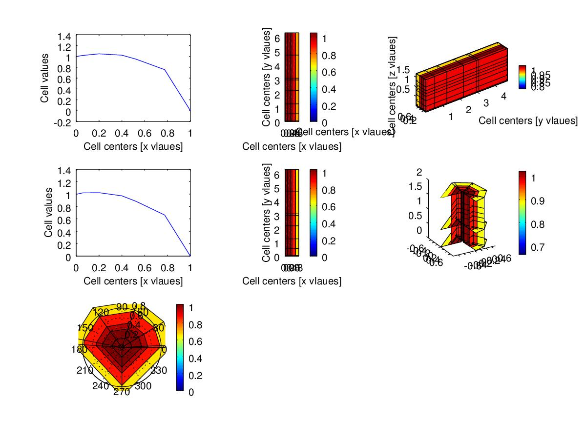
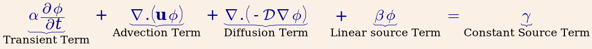
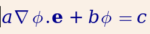
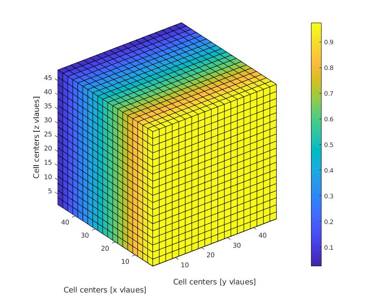

# FVTool: Finite volume toy toolbox for Matlab

[](http://dx.doi.org/10.5281/zenodo.18156)

This is a finite volume (toy) toolbox for chemical/petroleum engineers.
Right now, it can solve a transient convection-diffusion equation with variable velocity field/diffusion coefficients. The discretization schemes
include:
  * central difference diffusion term
  * central difference convection term
  * upwind convection term
  * TVD convection term with various flux limiters
  * transient term
  * Dirichlet, Neumann, Robin, and periodic boundary conditions



## Which equation do you solve?
You can solve the following PDE (or a subset of it):  


with the following boundary conditions:  


Believe it or not, the above equations describe the majority of the transport phenomena in chemical and petroleum engineering and similar fields.

## How to start
Download the package, start matlab, and run
   `FVToolStartUp`

## Inspiration
I started writing this tool after playing with [FiPy] (http://www.ctcms.nist.gov/fipy/), an amazing python-based finite volume solver.
This matlab solver is not a clone, and indeed very limited compared to FiPy.
I wrote it to have a very handy tool for testing new ideas (new mathematical models) by solving them in 1D uniform Cartesian grids.
Then I extended the code to
  * 1D axisymmetric (radial)
  * 2D radial (r, theta)
  * 2D Cartesian
  * 3D Cartesian
  * 2D axisymmetric (cylindrical, r, z)
  * 3D cylindrical (r, theta, z)

I have overloaded some of the matlab operators to simplify the switch from 1D codes to 2D and 3D.

### A simple example
You can solve a diffusion equation, i.e., $ \nabla. (-D \nabla \phi) = 0 $ by running the following code in Matlab:
```matlab
clc; clear;
L = 50;  % domain length
Nx = 20; % number of cells
m = createMesh1D(Nx, L);
BC = createBC(m); % all Neumann boundary condition structure
BC.left.a(:) = 0; BC.left.b(:)=1; BC.left.c(:)=1; % Dirichlet for the left boundary
BC.right.a(:) = 0; BC.right.b(:)=1; BC.right.c(:)=0; % right boundary
D_val = 1; % value of the diffusion coefficient
D = createCellVariable(m, D_val); % assign the diffusion coefficient to the cells
D_face = harmonicMean(D); % calculate harmonic average of the diffusion coef on the cell faces
Mdiff = diffusionTerm(D_face); % matrix of coefficients for the diffusion term
[Mbc, RHSbc] = boundaryCondition(BC); % matix of coefficients and RHS vector for the BC
M = Mdiff + Mbc; % matrix of cefficients for the PDE
c = solvePDE(m,M, RHSbc); % send M and RHS to the solver
visualizeCells(c); % visualize the results
```
change the third line to `m = createMesh2D(Nx,Nx, L,L);` or `m = createMesh3D(Nx,Nx,Nx, L,L,L);` and see the outcome for yourself.  


## Examples
There are a few simple examples in the [Tutorial](https://github.com/simulkade/FVTool/tree/master/Examples/Tutorial) folder.
You can also find a few more advanced examples (water injection into a heterogeneous oil field, two nonlinear PDE's, coupled
fully implicit solution) in the [Advanced](https://github.com/simulkade/FVTool/tree/master/Examples/Advanced) folder.

## Documents
comming soon

## But Matlab is not a free software?
You can use the code in [octave](http://www.gnu.org/software/octave/). The new (object oriented) version of the code works in Octave 4.0 (with the new `classdef` function).  
I've re-written the code in [Julia](http://julialang.org/). It works fine, but the visualization on Windows OS has still some issues.

## Questions and bug reports
You can ask your questions by creating a new issue here, or by writing a comment in [my blog] (http://fvt.simulkade.com). You can aslo ask your question in the [Matlab file exchange page] (http://www.mathworks.com/matlabcentral/fileexchange/46637-a-simple-finite-volume-solver-for-matlab) of this code. I truly appreciate your feedback and/or contribution.
